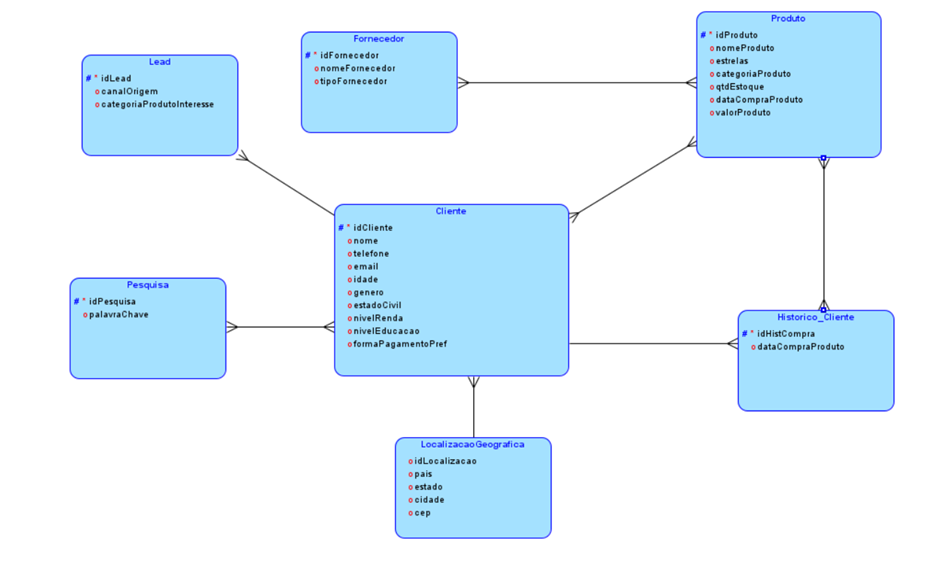

# SQL - DESAFIO 2024 - PLUSOFT 🎓

> Projeto desenvolvido durante as **Sprints 1, 2 e 3** da matéria **'MASTERING RELATIONAL AND NON-RELATIONAL DATABASE'**.

> Código completo disponível [aqui](2TDSPH_2024_CodigoSql_Integrantes.sql).

---

### 🚀 Sprint 1 - Nota: **100** 🌟
- **📊 Criação de DER/MER**: Desenvolvimento do Diagrama de Entidade-Relacionamento e Modelo Entidade-Relacionamento, definindo a estrutura do banco de dados.
- **🏗️ DDL**: Implementação da Linguagem de Definição de Dados para criar as tabelas e relacionamentos no banco de dados.
- **🔄 Blocos Anônimos de Consultas**: Criação de blocos anônimos para realizar consultas dinâmicas e manipulações de dados.
> Acesse os scripts da Sprint 1 [aqui](scripts/sprint1).

---

### 🚀 Sprint 2 - Nota: **100** 🌟
- **✅ Correções (se solicitadas)**: Implementação de ajustes e melhorias baseadas no feedback recebido.
- **🛠️ Funções de validação**: Desenvolvimento de funções personalizadas para validar dados inseridos no banco.
- **⚙️ Procedures (Insert, Update, Delete)**: Criação de procedimentos armazenados para operações básicas de manipulação de dados.
- **🔄 Procedures com Join e Cursor**: Implementação de procedimentos que utilizam joins e cursores para manipulação avançada de dados.
- **🔄 Procedures com funções, Inner Join, Order By, Sum/Count**: Criação de procedimentos complexos que combinam funções e agregações para relatórios.
> Acesse os scripts da Sprint 2 [aqui](scripts/sprint2).
---

### 🚀 Sprint 3 - Nota: **100** 🌟
- **Procedimentos (30 pontos)**
  1. **📊 Join + JSON**: Realiza joins entre tabelas e exibe os resultados em formato JSON, facilitando a integração com aplicações.
  2. **📈 Relatório**: Geração de relatórios que mostram valores atuais, anteriores e próximos em uma tabela, para análise de dados.

- **Funções (30 pontos)**
  1. **🔄 JSON**: Implementação de uma função que converte dados em formato JSON sem o uso de funções built-in, garantindo flexibilidade.
  2. **⚙️ Processamento**: Substituição de processos existentes, como a validação de senha, por soluções mais eficazes.

- **Gatilho (30 pontos)**
  - 📝 **Tabela de Auditoria**: Implementação de um gatilho que registra todas as operações de INSERT, UPDATE e DELETE, incluindo dados antigos e novos, usuário, operação e data para fins de auditoria.

- **Documentação (10 pontos)**
  - 📄 **Entrega da Documentação**: Preparação e entrega da documentação detalhada do projeto, incluindo explicações sobre as implementações realizadas e a estrutura do banco de dados.
> Acesse os scripts da Sprint 3 [aqui](scripts/sprint3).
---

### 🗂️ Modelagem

**Oracle Data Modeler (DER/MER):**  Utilizado para criar e gerenciar modelos de dados, o Oracle Data Modeler facilita a visualização e a estruturação do banco de dados, permitindo um desenvolvimento e manutenção mais eficazes do esquema.

#### 🧩 Modelo Lógico

Visualize a arquitetura do banco de dados no modelo lógico:

  

#### 🧩 Modelo Físico

Visualize a arquitetura do banco de dados no modelo físico:

  

---

### 🌐 Banco de Dados

**Oracle SQL:** É um sistema de gerenciamento de banco de dados relacional (RDBMS) desenvolvido pela Oracle Corporation. Sua robustez e flexibilidade tornam-no uma escolha popular para aplicações empresariais.

---

### 🖥️ IDE (Ambiente de Desenvolvimento Integrado)

**Oracle SQL Developer:** Uma ferramenta gratuita da Oracle que oferece uma interface gráfica amigável para o desenvolvimento e gerenciamento de bancos de dados. Com funcionalidades como suporte a SQL e PL/SQL, relatórios e visualização de dados, o SQL Developer facilita o trabalho de desenvolvedores e administradores de banco de dados.

## 🫂 Integrantes

Aqui estão os membros do grupo que participaram durante desenvolvimento destas SPRINTS.

* **RM 552267 - Bianca Leticia Román Caldeira**
  - Turma: 2TDSPH
  - Responsável: Mobile
    
* **RM 552252 – Charlene Aparecida Estevam Mendes Fialho**
  - Turma: 2TDSPH
  - Responsável: .NET & Java

* **RM 552258 - Laís Alves da Silva Cruz**
  - Turma: 2TDSPH
  - Responsável: Banco de Dados & DevOps
    
* **RM 97916 – Fabricio Torres Antonio**
  - Turma: 2TDSPH
  - Responsável: QA

* **RM 99675 – Lucca Raphael Pereira dos Santos**
  - Turma: 2TDSPZ
  - Responsável: IA/IoT

<table>
  <tr>
        <td align="center">
      <a href="https://github.com/biancaroman">
         
        
          <b>Bianca Román</b>
        
      </a>
    </td>
    <td align="center">
      <a href="https://github.com/charlenefialho">
         
        
          <b>Charlene Aparecida</b>
        
      </a>
    </td>
    <td align="center">
      <a href="https://github.com/laiscrz">
         
        
          <b>Lais Alves</b>
        
      </a>
    </td>
     <td align="center">
      <a href="https://github.com/Fabs0602">
         
        
          <b>Fabricio Torres</b>
        
      </a>
    </td>
    <td align="center">
      <a href="https://github.com/LuccaRaphael">
         
        
          <b>Lucca Raphael</b>
        
      </a>
    </td>
  </tr>
</table>

<a href="#top">Voltar para o topo</a>
